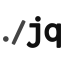

# .dotfiles

[](https://github.com/felippemauricio/dotfiles/actions/workflows/pages.yml)
[](https://github.com/felippemauricio/dotfiles/blob/master/LICENSE.md)
[](https://www.apple.com/macos/)
[](https://github.com/felippemauricio/dotfiles/pulls)

Sensible developer defaults for macOS. One command provisions a fresh machine:
Homebrew and a curated set of command-line tools and applications, Oh My Zsh, the
shell configuration, and the Node and Python toolchains.

📖 **Full documentation:** **<https://felippemauricio.github.io/dotfiles/>**

## Prerequisites

- macOS on Apple Silicon (Homebrew is expected at `/opt/homebrew`)
- The Xcode command-line tools (the installer triggers their installation)

## Install

```sh
git clone https://github.com/felippemauricio/dotfiles.git
cd dotfiles
./install.sh
```

Then restart your terminal.

## What the installer does

`install.sh` runs each step below in order. Every script is `set -euo pipefail`
and is also runnable on its own.

| Step | Script                 | What it does                                                                                                |
| ---- | ---------------------- | ----------------------------------------------------------------------------------------------------------- |
| 1    | `scripts/homebrew.sh`  | Installs Homebrew (if missing), then installs everything in the `Brewfile`.                                 |
| 2    | `scripts/oh-my-zsh.sh` | Triggers the Xcode command-line tools install and installs Oh My Zsh.                                       |
| 3    | `scripts/shell.sh`     | Copies the zsh config to `~/.dotfiles.zsh` (sourced from `~/.zshrc`) and the tmux config to `~/.tmux.conf`. |
| 4    | `scripts/languages.sh` | Installs Node (latest LTS via nvm) and Python (latest stable via pyenv).                                    |

## What gets installed

Everything except Homebrew and Oh My Zsh is declared in the [`Brewfile`](Brewfile)
and applied with `brew bundle` — formulae (`brew`) are command-line tools, casks
(`cask`) are GUI applications. To add or remove a package, edit that file and
re-run `brew bundle`.

### 🍺 Homebrew

-  **[Homebrew](https://brew.sh/)** — the macOS package manager that installs everything below.

### ⌨️ Developer command-line tools

-  **[acli](https://developer.atlassian.com/cloud/acli/)** — Atlassian command-line interface: Jira and Confluence from the terminal. Installed from the official `atlassian/acli` tap.
-  **[gh](https://cli.github.com/)** — GitHub from the terminal: pull requests, issues and repositories.
-  **[git](https://git-scm.com/)** — distributed version control.
-  **[glab](https://gitlab.com/gitlab-org/cli)** — GitLab from the terminal: merge requests, issues and pipelines.
-  **[jq](https://jqlang.org/)** — command-line JSON processor for slicing, filtering and transforming JSON.
-  **[mitmproxy](https://mitmproxy.org/)** — interactive HTTPS proxy for inspecting and debugging HTTP(S) traffic (`mitmproxy`, `mitmweb` and `mitmdump`). Command-line tool, but installed as a Homebrew cask (its only distribution).
- 🔍 **[ripgrep](https://github.com/BurntSushi/ripgrep)** — extremely fast recursive search (`rg`) that respects `.gitignore`.
-  **[terraform](https://developer.hashicorp.com/terraform)** — infrastructure as code; provisions and manages cloud resources declaratively. Installed from the official `hashicorp/tap`.
-  **[terragrunt](https://terragrunt.gruntwork.io/)** — thin wrapper around terraform that keeps configurations DRY across environments.
-  **[tmux](https://github.com/tmux/tmux)** — terminal multiplexer: splits the terminal into panes and keeps sessions alive; powers the `claudio` command and the Claude Code agent-team split-pane workflow.

#### ☁️ Cloud CLIs

-  **[awscli](https://aws.amazon.com/cli/)** — Amazon Web Services command-line interface.
-  **[azure-cli](https://learn.microsoft.com/cli/azure/)** — Microsoft Azure command-line interface.

#### 🔄 Version managers

-  **[nvm](https://github.com/nvm-sh/nvm)** — Node Version Manager; install and switch between Node.js versions.
-  **[pyenv](https://github.com/pyenv/pyenv)** — Python version manager; install and switch between Python versions.

### 🐳 Developer tools

-  **[Cursor](https://cursor.com/)** — AI-first code editor (a Visual Studio Code fork).
-  **[DBeaver](https://dbeaver.io/)** — universal database client; browse schemas, run SQL and inspect data. Installed as the free Community Edition.
-  **[Docker Desktop](https://www.docker.com/products/docker-desktop/)** — builds, runs and manages Docker containers locally.
-  **[iTerm2](https://iterm2.com/)** — feature-rich terminal emulator for macOS.
-  **[Postman](https://www.postman.com/)** — API client for building and testing HTTP requests.
-  **[Visual Studio Code](https://code.visualstudio.com/)** — extensible code editor.

### 🤖 AI — models, assistants & coding agents

-  **[Antigravity CLI](https://antigravity.google/)** — Google's Gemini-powered agentic coding tool for the terminal.
- 🍏 **[apfel](https://apfel.franzai.com)** — Apple Intelligence from the command line, with an OpenAI-compatible API server.
-  **[ChatGPT Atlas](https://openai.com/)** — OpenAI's ChatGPT desktop browser.
-  **[Claude](https://claude.ai/)** — Anthropic's Claude desktop app.
-  **[Claude Code](https://claude.com/product/claude-code)** — Anthropic's agentic coding tool for the terminal.
-  **[Codex](https://github.com/openai/codex)** — OpenAI's command-line coding agent.
-  **[Codex app](https://openai.com/codex)** — OpenAI's Codex desktop app.
-  **[Gemini](https://gemini.google/)** — Google's native Gemini desktop assistant.
- 🦙 **[ollama](https://ollama.com/)** — runs open large language models locally (Llama, Gemma, Qwen and more), with an OpenAI-compatible API server. Start the background service with `brew services start ollama`.
-  **[opencode](https://opencode.ai/)** — model-agnostic AI coding agent for the terminal (works with Claude, GPT, Gemini or local models). Installed from the `anomalyco/tap` tap.
-  **[opencode desktop](https://opencode.ai/)** — the opencode desktop client.

### 🐚 Shell — Oh My Zsh

-  **[Oh My Zsh](https://ohmyz.sh/)** — community framework for managing your zsh configuration (themes, plugins, sensible defaults). The dotfiles zsh config is layered on top — see [Shell configuration](#shell-configuration).

### 🌐 Browsers

-  **[Google Chrome](https://www.google.com/chrome/)** — web browser.

### 💬 Messaging & communication

-  **[Discord](https://discord.com/)** — voice, video and text chat for communities.
-  **[Microsoft Teams](https://www.microsoft.com/microsoft-teams/)** — team chat, calls and meetings.
-  **[Slack](https://slack.com/)** — team messaging.
-  **[WhatsApp](https://www.whatsapp.com/)** — messaging desktop app.
-  **[Zoom](https://zoom.us/)** — video conferencing.

### 🧰 Productivity & utilities

-  **[1Password](https://1password.com/)** — password manager and secure vault.
-  **[1Password CLI](https://developer.1password.com/docs/cli/)** — `op`, 1Password from the command line; injects secrets into scripts and tools (pairs with the desktop app's CLI integration).
-  **[Clipy](https://clipy-app.com/)** — lightweight clipboard-history manager.
-  **[Dropbox](https://www.dropbox.com/)** — cloud file storage and sync.
-  **[Microsoft Office](https://www.microsoft.com/microsoft-365)** — office suite: Word, Excel, PowerPoint, Outlook and OneNote.
-  **[Rectangle](https://rectangleapp.com/)** — window manager; snap and resize windows with keyboard shortcuts.

### 🎵 Media

-  **[Spotify](https://www.spotify.com/)** — music streaming.

## Shell configuration

`scripts/shell.sh` installs the zsh config as `~/.dotfiles.zsh` (sourced from
`~/.zshrc`) and the tmux config as `~/.tmux.conf` (mouse on, plus a large
scrollback so you can scroll far up to re-read output). On every new shell it:

- loads Homebrew into the environment (Apple Silicon `/opt/homebrew` prefix);
- initialises **nvm** and automatically switches to the Node version in a
  project's `.nvmrc` when you `cd` into it (reverting to the default otherwise);
- initialises **pyenv**;
- defines the `ag` alias for **ripgrep** (`rg`) — muscle memory from
  the_silver_searcher;
- defines the `claudio` command, which launches Claude Code inside a fresh
  **tmux** session each time (so agent-team teammates open in side-by-side panes,
  and several sessions in the same folder stay isolated); and
- opens your `~/Workspace` directory.

## Version managers

Node is managed with **nvm** and Python with **pyenv** — the two version
managers loaded by the shell configuration above. `languages.sh` installs the
latest Node LTS and the latest stable Python and sets both as the global
defaults.

## Documentation

The full guide and reference live on the docs site, built with VitePress and
published to GitHub Pages on every push to `master`:

**<https://felippemauricio.github.io/dotfiles/>**

- **Guide** — getting started, installation, the scripts, the version managers,
  and what gets installed.
- **Reference** — the annotated `Brewfile`.

## Licence

Licensed under the MIT Licence, Copyright © 2019-present Felippe Maurício.
